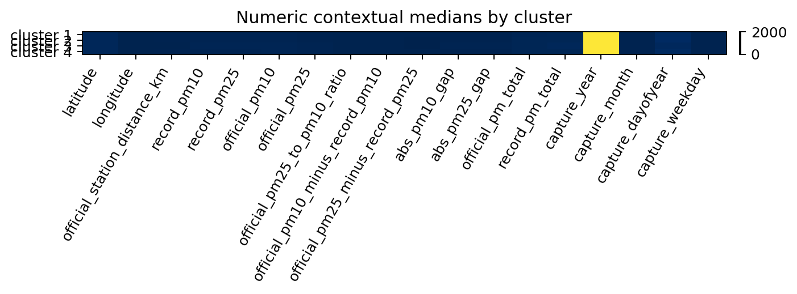
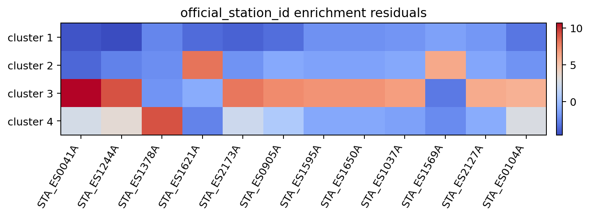
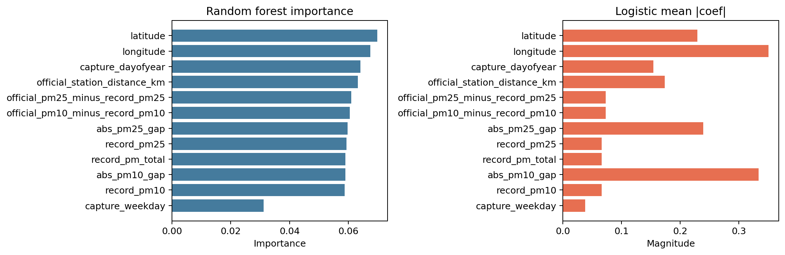

# Context Analysis Results

This step was run for the selected final solution `pca_scores__kmeans__k-4` on `2565` images. It tests whether the morphology clusters are associated with the available environmental and temporal context variables.

## Main findings

- The strongest numeric associations were with `capture_year`, `capture_dayofyear`, `abs_pm10_gap`, `official_station_distance_km`, and `official_pm25`.
- The strongest categorical associations were with `official_station_id`, `official_pm25_band`, `capture_season`, and `station_distance_band`.
- Context-only predictive recovery was moderate, not perfect:
  - random forest balanced accuracy: `0.649`
  - logistic balanced accuracy: `0.542`

## Interpretation

The results show that the clusters are meaningfully associated with context, especially time and station-related variables. However, context alone does not fully explain cluster membership, which suggests that the morphology clusters are not reducible to a single environmental variable.

## Conclusion

The contextual analysis provides useful support for interpretation, but it should be presented as association and enrichment, not as direct proof of pollutant composition or source.

## Figures

