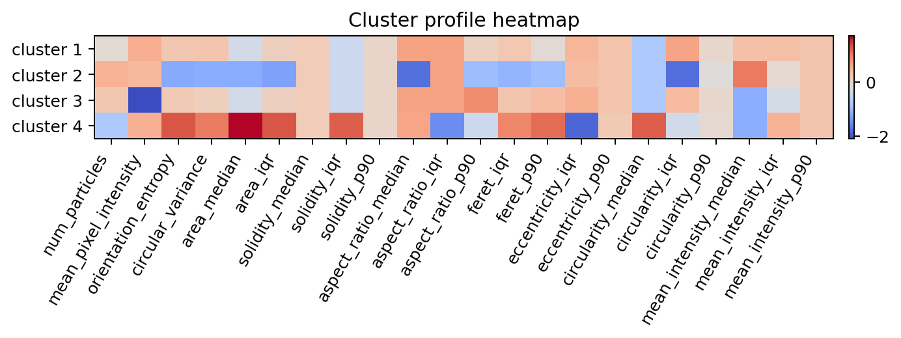
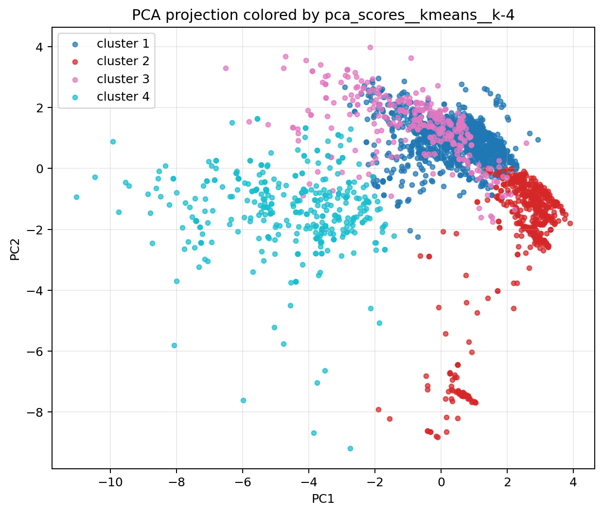
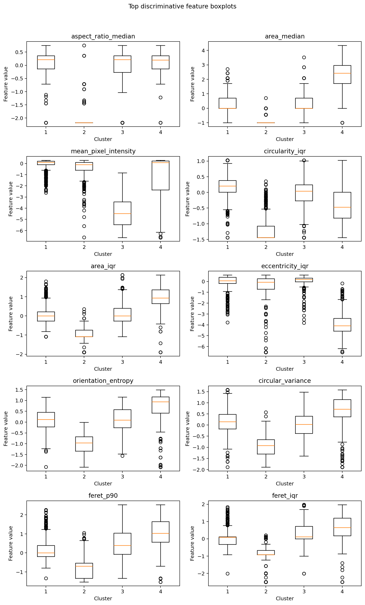

# Explainability Results

This step was run for the selected final solution `pca_scores__kmeans__k-4` on `2565` images. The output confirms that the final clustering is interpretable in morphological terms and is not just a black-box partition.

## Main findings

- The selected solution has `4` clusters with proportions of about `52.0%`, `21.4%`, `12.4%`, and `14.2%`.
- The strongest discriminative saved features are `aspect_ratio_median`, `area_median`, `mean_pixel_intensity`, `circularity_iqr`, `area_iqr`, and `eccentricity_iqr`.
- The cluster patterns are stable enough to be recovered by surrogate models:
  - random forest balanced accuracy: `0.971`
  - logistic balanced accuracy: `0.991`

## Cluster-level interpretation

- Cluster 1: heterogeneous circularity and generally less circular particles.
- Cluster 2: smaller and more compact particles, with lower elongation and more aligned orientations.
- Cluster 3: very elongated tail cases with darker deposits.
- Cluster 4: larger, rounder, more dispersed particle patterns.

## Conclusion

The explainability layer supports the idea that the clusters capture real and readable morphology patterns. In other words, the final model is not only stable, but also interpretable through feature profiles, representative examples, and simple surrogate recovery.

## Figures

