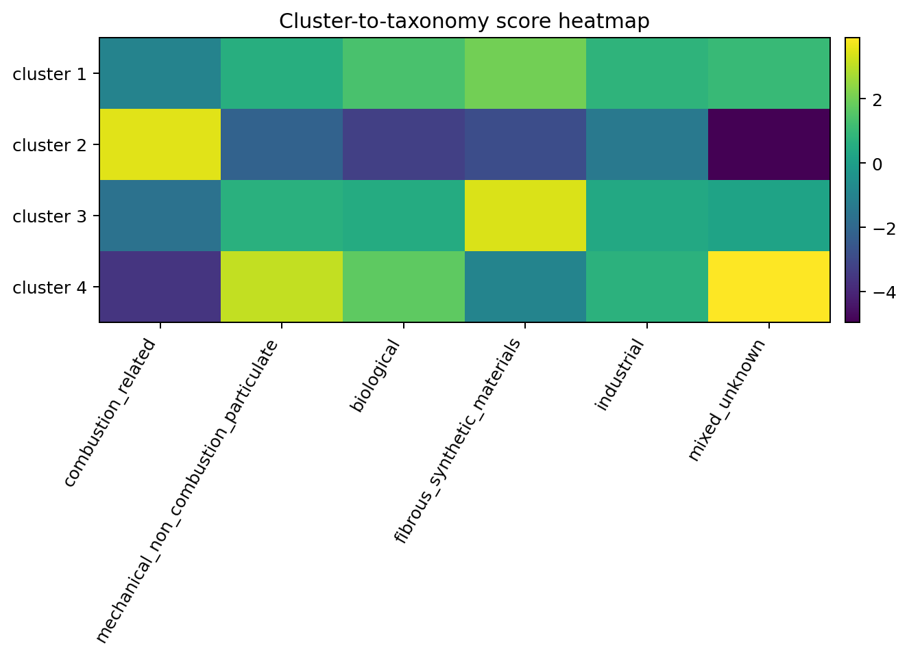

# Taxonomy Results

This step converts the explainability outputs into cautious source-category suggestions. It is a heuristic interpretation layer and should not be presented as chemical identification.

## Main findings

- Cluster 1: primary suggestion `fibrous_synthetic_materials`, with `biological` as a secondary possibility.
- Cluster 2: primary suggestion `combustion_related`, with high confidence.
- Cluster 3: primary suggestion `fibrous_synthetic_materials`, with high confidence.
- Cluster 4: primary suggestion `mixed_unknown`, with `mechanical_non_combustion_particulate` as the main secondary interpretation.

## Interpretation

These suggestions are based on cluster morphology summaries and score rules derived from the explainability profiles. The six-category schema used here is:

- `combustion_related`
- `mechanical_non_combustion_particulate`
- `biological`
- `fibrous_synthetic_materials`
- `industrial`
- `mixed_unknown`

The labels are useful for thesis discussion because they give a cautious environmental meaning to each cluster, but they remain tentative.

## Conclusion

The taxonomy layer is best used as a communication and interpretation aid. It helps connect morphology patterns to plausible source scenarios, while keeping the thesis claim academically safe and honest.

## Figure

